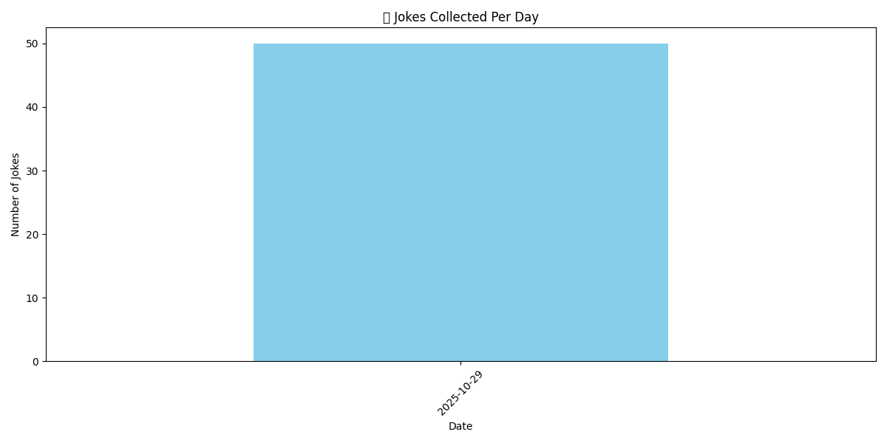
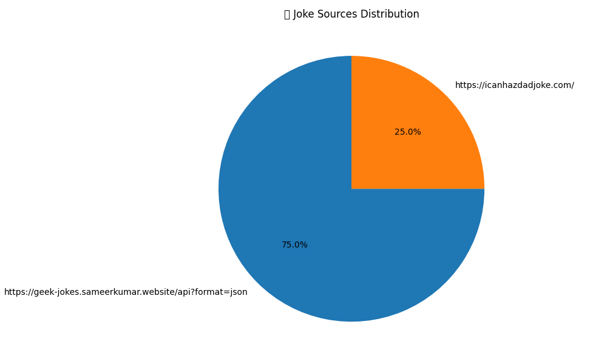
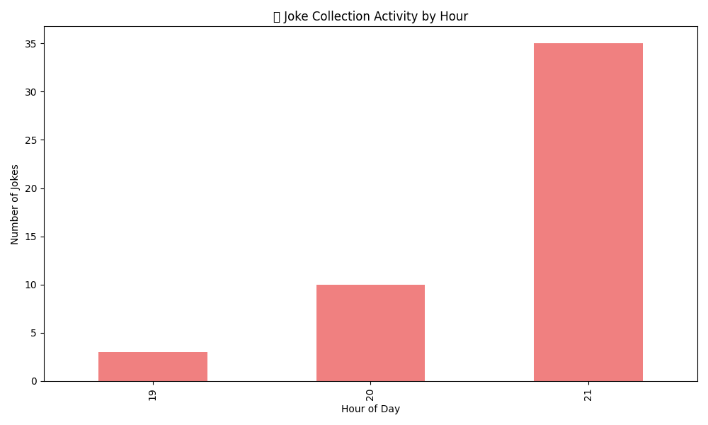

# Daily Joke Bot

This project is an automated joke bot that runs as a background service on your system.

## Features

1.  **Fetches Jokes:** At a regular interval (which you can configure), it fetches a new joke from one of several random internet sources (like JokeAPI, DadJoke, ChuckNorris, etc.).
2.  **Stores Jokes:** It saves the latest joke to `joke.txt` and appends it to a running history in `joke_history.md` and `history.csv`.
3.  **Commits to Git:** It automatically commits the new joke to the Git repository and pushes it to the `main` branch on a remote server.
4.  **Notifies You:** When a new joke is fetched, it plays a sound and displays a desktop notification.

## How it works

The main logic is in the `joke-bot.sh` script, and the `.config/systemd/user/joke-bot.service` file ensures this script runs automatically.

## Data visualizations

Run `scripts/generate_charts.py` to build summary charts from `history.csv`. The latest renderings live in the `charts/` directory and can be viewed below:

